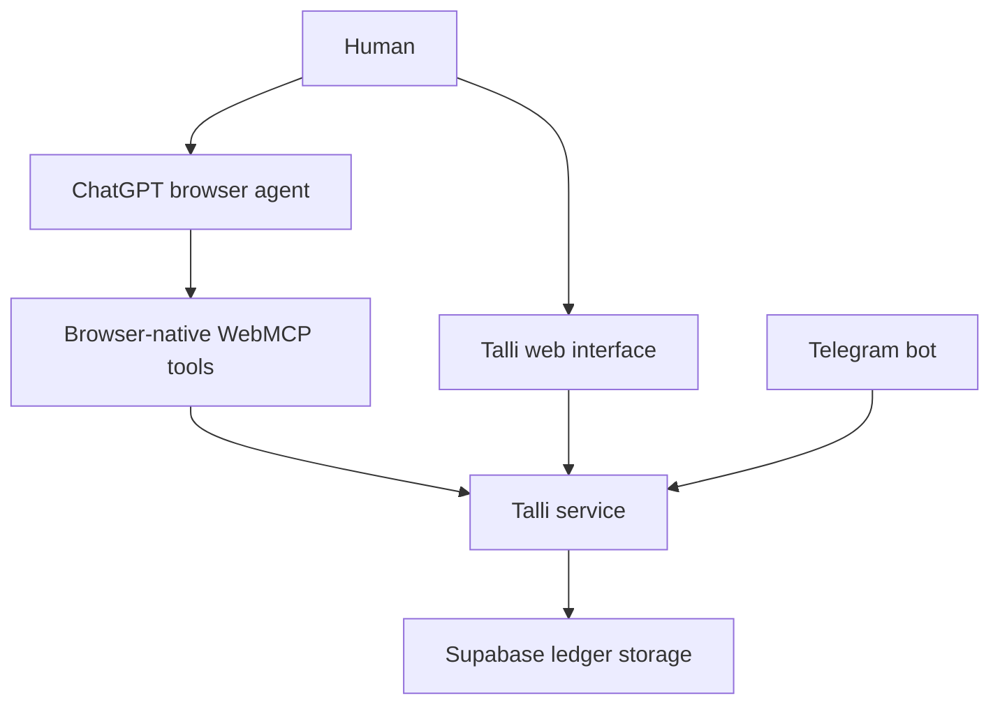

# Talli

### The agent-native conversational credit ledger for small businesses

Talli helps small businesses record customer credit using ordinary speech or text, while allowing trusted browser agents to search, understand, and safely prepare updates to the same live ledger through WebMCP.

The agent can do the administrative work. The human keeps control of every financial decision.

[Live Application](https://talli-webmcp.onrender.com/) · [Telegram Bot](https://t.me/TalliMCP_bot) · [WebMCP Documentation](https://developer.chrome.com/docs/ai/webmcp)

---

## The Problem

Customer credit is part of everyday business.

A trusted customer takes groceries today and promises to pay on Friday. A regular buyer collects supplies and pays in instalments. Another customer makes a partial payment, leaving a smaller balance for later.

For large businesses, accounting teams and dedicated software manage these transactions. But many small shops, market traders, independent sellers, home businesses, and service providers still track customer debt using:

* paper notebooks
* WhatsApp or Telegram messages
* calculator notes
* spreadsheets
* memory
* a mixture of several disconnected systems

The problem is not that these business owners do not understand their businesses. The problem is that most financial software does not match the way they naturally work.

A merchant does not think:

> Create a new debtor record, select a transaction category, enter an accounts-receivable amount, and update the balance.

They think:

> Adele took goods worth $650 and will pay next Friday.

Later, they might say:

> She paid $100 today.

That simple conversation hides a difficult record-keeping problem. The system must understand who “she” refers to, locate the correct debt, apply a partial payment, preserve the transaction history, and calculate the remaining balance correctly.

A mistake is not just a bad database entry. It can mean lost income, a customer dispute, or an inaccurate understanding of how much money the business is owed.

---

## The Solution

Talli is a conversational credit ledger designed around the way people naturally describe financial activity.

Instead of filling out accounting forms, a merchant can speak or type:

> Adele Johnson took goods worth $650 on credit.

Talli converts that sentence into structured financial state:

* the customer
* the original credit amount
* the currency
* the outstanding balance
* the date of the transaction
* the expected payment date, when provided
* the history of later payments or corrections

The merchant can then ask:

* “How much does Adele Johnson owe?”
* “Who still owes me money?”
* “Which debts are overdue?”
* “Show me Adele’s payment history.”
* “Adele paid $100.”
* “Settle the remaining balance.”
* “Correct the amount I entered earlier.”

Talli maintains the ledger across interactions instead of treating each message as an isolated chatbot conversation.

It supports:

* new customer credit
* partial payments
* full settlements
* customer balances
* transaction histories
* due dates
* overdue debt discovery
* customer names and aliases
* corrections
* ambiguity detection
* persistent web sessions
* Telegram access
* browser-agent collaboration through WebMCP

Talli is not trying to replace a full accounting platform. It focuses on one painful, frequent workflow and makes it dramatically easier: remembering who owes the business money and keeping that record correct.

---

## Why WebMCP Changes the Experience

An ordinary AI browser agent interacts with a website by looking at the page and attempting to operate the interface like a person.

It may need to:

* inspect text on the screen
* locate a customer card
* identify the correct button
* open a form
* decide which field corresponds to an amount
* enter values
* simulate clicks
* infer whether the operation succeeded

That is fragile for any application. It is especially risky when the application contains financial records.

Talli uses WebMCP to expose its actual capabilities directly to the browser agent.

Through `document.modelContext.registerTool(...)`, Talli tells the agent:

* which operations are available
* what each operation does
* what structured input it accepts
* which tools are read-only
* which tools may prepare a mutation
* what happened after execution
* when the request is ambiguous
* when human confirmation is required

The agent no longer needs to guess how the page works. It can call a structured tool backed by Talli’s live application state.

This makes Talli more than a website that an agent can click through. It becomes an agent-native financial workspace where the person, the browser agent, and the application each have a clearly defined role.

---

## Why Talli Is a Strong WebMCP Use Case

Talli combines two properties that make WebMCP particularly valuable:

1. The work is repetitive enough for an agent to help.
2. The state is consequential enough that the agent should not have unlimited authority.

Searching customer records, reviewing transaction histories, calculating totals, and identifying overdue balances are useful tasks to delegate.

Changing a financial ledger is different.

An agent should not silently decide which Adele made a payment. It should not apply a stale proposal after the ledger has changed. It should not record the same payment twice because a request was retried. It should not be able to prepare and secretly approve its own transaction.

Talli uses WebMCP to establish a safe collaboration boundary:

| Participant   | Responsibility                                                                                        |
| ------------- | ----------------------------------------------------------------------------------------------------- |
| Human         | Gives instructions, resolves ambiguity, reviews proposals, and confirms financial changes             |
| Browser agent | Searches, summarizes, explains, and prepares structured actions                                       |
| Talli         | Validates requests, resolves ledger entities, blocks unsafe operations, and preserves financial state |

The agent is useful without becoming the final financial authority.

That is the central idea behind Talli:

> Delegate the work, not the accountability.

---

## Human and Agent Collaboration

A typical WebMCP interaction begins with a natural request:

> Check Talli and tell me how much my customers currently owe.

The browser agent discovers Talli’s registered tools and calls `get_ledger_summary`.

Talli returns a bounded, structured summary from the same ledger displayed on the page.

The merchant can then say:

> Prepare a new $150 credit entry for Adele Johnson.

The agent calls `prepare_ledger_mutation`.

Talli validates the request and creates a short-lived proposal. The ledger does not change. Instead, Talli displays a visible review card showing the exact customer, operation, and amount.

The merchant reviews the proposal and clicks **Confirm** inside Talli.

Only then is the transaction recorded.

Now consider a less precise request:

> Adele paid $100. Update her balance.

If the ledger contains Adele Johnson and Adele Williams, Talli returns `clarification_required`.

It provides a bounded list of possible matches, prevents confirmation, and leaves the ledger unchanged.

The agent can ask the merchant which Adele they meant. Once the person clarifies, the operation can be prepared safely.

This is not merely an AI controlling a website. It is a multi-step collaboration in which:

* the human communicates naturally
* the agent handles retrieval and preparation
* the application enforces domain-specific safety
* the human retains final control

---

## WebMCP Tool Surface

Talli registers exactly seven browser-native tools when `document.modelContext` is available.

| Tool                      | Purpose                                                          | Access              |
| ------------------------- | ---------------------------------------------------------------- | ------------------- |
| `get_ledger_summary`      | Summarizes current outstanding credit and ledger activity        | Read-only           |
| `search_customers`        | Finds customers using names, aliases, or identifiers             | Read-only           |
| `get_customer_balance`    | Returns the current balance for a safely resolved customer       | Read-only           |
| `get_customer_history`    | Explains the transactions behind a customer’s balance            | Read-only           |
| `list_overdue_debts`      | Finds open obligations that have passed their due dates          | Read-only           |
| `prepare_ledger_mutation` | Prepares a credit entry, payment, or settlement for human review | Proposal only       |
| `cancel_ledger_mutation`  | Cancels the current pending proposal without changing the ledger | Proposal management |

There is intentionally no `confirm_ledger_mutation` tool.

The browser agent can prepare a financial change, but it cannot approve that change. Confirmation remains a first-party human action inside Talli’s visible interface.

This is an intentional product and security decision—not a missing capability.

---

## Safe Financial Delegation

Talli separates financial updates into distinct stages:

1. **Intent**
   The person describes what they want in natural language.

2. **Resolution**
   Talli identifies the relevant customer and obligation.

3. **Validation**
   Talli checks the amount, currency, current ledger state, and operation.

4. **Proposal**
   A structured, short-lived mutation proposal is created.

5. **Human review**
   The exact change appears in the visible Talli interface.

6. **Confirmation**
   The person—not the browser agent—approves the operation.

7. **Application**
   Talli records the event and updates the ledger exactly once.

A proposal does not contain unrestricted instructions for the backend to execute later. Talli stores the validated action server-side and gives the browser an opaque proposal identifier.

Before applying a proposal, Talli checks that:

* it belongs to the current session
* it is still pending
* it has not expired
* it has not already been confirmed
* it has not been cancelled
* the underlying ledger has not changed unexpectedly
* the stored action is still valid

This prevents an old or modified proposal from being applied to a different financial state.

---

## Ambiguity Is a First-Class Outcome

Most software treats ambiguity as an error to hide. Talli treats it as an expected part of real business language.

Customers may share first names. A customer may be known by a nickname. A merchant may have more than one open credit entry for the same person. Words such as “she,” “him,” or “the last one” may depend on previous context.

For financial operations, silently choosing the most likely answer is not good enough.

Talli can return explicit outcomes such as:

* `confirmation_required`
* `clarification_required`
* `rejected`
* `cancelled`
* `expired`
* `stale`
* `already_confirmed`

A typical ambiguous response contains:

* a stable reason code
* a plain-language explanation
* a bounded list of possible customers or obligations
* current balances needed to distinguish them
* confirmation that the ledger was not changed

This structured response allows the browser agent to continue the conversation intelligently.

Instead of reporting a generic failure, it can ask:

> I found Adele Johnson and Adele Williams. Which customer made the payment?

The human supplies the missing information, and the workflow continues safely.

Talli does not guess with people’s money.

---

## Why This Is Better Than a CRUD Wrapper

A basic WebMCP integration could expose direct functions such as:

* create a record
* update a record
* delete a record

That would make the application agent-accessible, but it would not make it agent-safe.

Talli’s WebMCP layer is designed around financial intent rather than database operations.

The agent does not decide how tables should be changed. It submits a constrained domain action. Talli then applies the same entity resolution, validation, ambiguity handling, session ownership, and ledger rules used by the rest of the application.

WebMCP is therefore not an extra API attached to Talli. It is a structured collaboration layer over Talli’s financial domain model.

---

## Browser-Native WebMCP Implementation

Talli uses imperative browser-native registration:

```javascript
document.modelContext.registerTool({
  name: "get_ledger_summary",
  description: "Get a concise summary of the current Talli credit ledger.",
  inputSchema: {
    type: "object",
    properties: {},
    additionalProperties: false
  },
  annotations: {
    readOnlyHint: true
  },
  execute: async () => {
    // Read the current same-origin Talli ledger
  }
});
```

The complete tool implementation is located in:

```text
public/webmcp-tools.js
```

Implementation details include:

* feature detection for `document.modelContext`
* imperative registration with `registerTool`
* duplicate-registration protection
* strict JSON Schemas
* `additionalProperties: false` at object boundaries
* clear read-only and mutation annotations
* deliberate untrusted-content annotations
* same-origin API requests
* cookie-bound session reuse
* `AbortSignal` support
* bounded JSON responses
* visible collaboration activity
* graceful fallback when WebMCP is unavailable

Every tool returns structured JSON rather than relying on visual page text.

Browsers without `document.modelContext` can still use Talli normally. WebMCP is implemented as progressive enhancement rather than a requirement for the core application.

---

## Tool Security and Trust Boundaries

Talli’s WebMCP implementation follows several important boundaries.

### Same-origin execution

The browser tools call Talli’s same-origin endpoints. The application does not expose an unrestricted cross-origin financial interface.

Production responses include:

```text
Origin-Agent-Cluster: ?1
Permissions-Policy: tools=(self)
```

### Strict inputs

Tool inputs use strict schemas. Unexpected fields are rejected rather than silently accepted.

This prevents an agent or caller from supplying internal fields such as:

* session ownership
* proposal status
* stored actions
* timestamps
* ledger fingerprints
* confirmation state

### Bounded outputs

Read tools return the information required to complete the current task instead of dumping the entire ledger.

### Untrusted ledger content

Customer names, aliases, notes, and other user-generated ledger values are treated as untrusted content. They are data returned by the tool, not instructions for the agent.

### Signed browser sessions

Anonymous visitors receive cryptographically random browser sessions signed with `SESSION_SECRET`.

The session cookie is:

* HTTP-only
* `SameSite=Lax`
* scoped to `/`
* time-limited
* marked Secure in production

Browser-facing routes reject caller-supplied session overrides. One visitor cannot request another visitor’s ledger by adding a `sessionId` parameter.

---

## Architecture



### Browser interface

The frontend provides:

* voice input
* typed input
* ledger summaries
* customer records
* transaction histories
* a visible proposal-review card
* clarification states
* confirmation and cancellation controls
* a human-readable collaboration activity feed
* Telegram account linking

### WebMCP layer

The browser integration:

* registers the seven tools
* translates tool calls into same-origin requests
* normalizes responses
* informs the visible UI when proposals or clarification states are created
* does not expose human confirmation as an agent tool

### Application service

The TypeScript service handles:

* customer resolution
* obligation resolution
* financial validation
* mutation preparation
* proposal ownership
* proposal expiry
* stale-state detection
* idempotent confirmation
* event creation
* ledger reconstruction
* Telegram and browser identity mapping

### Storage

Production data is stored in Supabase/PostgreSQL.

Talli’s ledger is event-based: credits, payments, settlements, and corrections are stored as financial events from which current balances and histories are derived.

File-backed storage is also available for local development.

---

## Telegram and Web Share One Ledger

Talli is designed to fit into tools that small business owners already use.

A browser session can be linked to the Talli Telegram bot through a short-lived connection token. Once connected, the web interface and Telegram resolve to the same Talli user and ledger.

A merchant can:

* record a credit from Telegram
* review the balance on the web
* ask a browser agent for a summary
* prepare a change through WebMCP
* confirm that change inside Talli

The channel may change, but the financial state remains consistent.

Telegram: [@TalliMCP_bot](https://t.me/TalliMCP_bot)

---

## Example Demo Journey

The following workflow demonstrates Talli’s main WebMCP capabilities.

### 1. Open Talli in ChatGPT’s in-app browser

```text
Open https://talli-webmcp.onrender.com
```

### 2. Request a ledger summary

```text
Use Talli to tell me the total amount my customers currently owe and summarize their balances.
```

ChatGPT discovers and calls Talli’s `get_ledger_summary` tool.

### 3. Prepare a credit entry

```text
Use Talli to prepare a new $150 credit entry for Adele Johnson. Do not confirm it for me.
```

Talli validates the request, creates a proposal, and displays it in the visible interface. The ledger remains unchanged.

### 4. Confirm as the human

Review the proposal card and click **Confirm** inside Talli.

The ledger updates exactly once.

### 5. Test ambiguity safety

```text
Adele just paid $100. Use Talli to update her balance.
```

If more than one customer matches “Adele,” Talli returns `clarification_required`, lists bounded candidates, blocks the mutation, and leaves the ledger unchanged.

This short journey demonstrates:

* WebMCP tool discovery
* structured read operations
* live shared application state
* safe mutation preparation
* visible human review
* human-only confirmation
* ambiguity detection
* structured agent-human handoff
* persistent financial state

---

## How to Use Talli

### Use the web application

1. Open [talli-webmcp.onrender.com](https://talli-webmcp.onrender.com/).
2. Select your preferred currency.
3. Type a financial update or use the microphone.
4. Review Talli’s interpretation.
5. Check customer balances and histories from the ledger.
6. Confirm consequential changes when prompted.

Example messages:

```text
Adele Johnson took goods worth $650 on credit.
```

```text
Adele paid $100 today.
```

```text
How much does Adele Johnson still owe?
```

```text
Who has an overdue balance?
```

### Use Talli through ChatGPT

1. Open the live Talli URL in ChatGPT’s in-app browser.
2. Allow the page to load and register its WebMCP tools.
3. Ask ChatGPT to use Talli for a ledger task.
4. Review any clarification returned by Talli.
5. For mutations, switch to the visible Talli page.
6. Review and confirm the proposal yourself.

### Connect Telegram

1. Open Talli in the browser.
2. Select **Connect Telegram**.
3. Open the generated link for `@TalliMCP_bot`.
4. Send the prefilled `/start` command.
5. Return to Talli and wait for the connection status to update.

After connecting, Telegram commands include:

```text
/start
/help
/balance
/customers
```

---

## Technology Stack

| Layer               | Technology                                |
| ------------------- | ----------------------------------------- |
| Web interface       | HTML, CSS, plain JavaScript               |
| WebMCP integration  | `document.modelContext.registerTool(...)` |
| Backend             | Node.js and TypeScript                    |
| Validation          | Zod and strict JSON Schema                |
| Financial model     | Event-sourced ledger                      |
| Production database | Supabase/PostgreSQL                       |
| Messaging           | Telegram Bot API                          |
| AI interpretation   | OpenAI-compatible structured-output model |
| Voice transcription | OpenAI-compatible transcription provider  |
| Hosting             | Render                                    |
| Testing             | Vitest                                    |
| Code quality        | TypeScript and Biome                      |
| Source control      | Git and GitHub                            |

---

## Project Structure

```text
public/
├── index.html                 Main web interface
├── styles.css                 Application styling
├── app.js                     Browser application behavior
├── webmcp-tools.js            WebMCP tool registration
└── proposal-workbench.js      Proposal and activity helpers

src/
├── app/
│   ├── api.ts                 HTTP routes and static serving
│   ├── talli-service.ts       Application orchestration
│   ├── ledger-mutations.ts    Safe mutation contracts
│   ├── storage.ts             Storage interfaces and state
│   └── supabase-storage.ts    Production persistence
├── domain/
│   ├── ledger.ts              Ledger projection and rules
│   ├── actions.ts             Financial action definitions
│   └── money.ts               Currency and amount handling
├── integrations/
│   └── telegram/              Telegram bot and webhook
└── llm/                       Structured interpretation

supabase/
└── migrations/                PostgreSQL schema and migrations

tests/                         Automated test suite
docs/                          Deployment and challenge documentation
```

---

## Running Talli Locally

### Requirements

* Node.js
* npm
* Git

### Installation

```bash
git clone https://github.com/Kunmiesther/Talli-WebMCP.git
cd Talli-WebMCP
npm ci
```

Copy the environment template:

```bash
cp .env.example .env
```

Build and verify the project:

```bash
npm run build
npm run typecheck
npm test
```

Start the development server:

```bash
npm run dev:api
```

Open the local URL displayed in the terminal.

---

## Environment Variables

### Application and storage

```env
SESSION_SECRET=
TALLI_STORAGE_DRIVER=
SUPABASE_URL=
SUPABASE_SERVICE_ROLE_KEY=
TALLI_TIMEZONE=
```

For production:

```env
TALLI_STORAGE_DRIVER=supabase
```

### AI interpretation

```env
TALLI_INTERPRETER_MODE=
OPENAI_API_KEY=
OPENAI_MODEL=
OPENAI_BASE_URL=
```

### Voice transcription

```env
TRANSCRIPTION_API_KEY=
TRANSCRIPTION_MODEL=
TRANSCRIPTION_BASE_URL=
```

### Telegram

```env
TELEGRAM_BOT_TOKEN=
TELEGRAM_BOT_USERNAME=
TELEGRAM_WEBHOOK_SECRET=
TALLI_PUBLIC_URL=
```

### Local runtime

```env
TALLI_DATA_DIR=
TALLI_LEDGER_FILE=
TALLI_STATE_FILE=
TALLI_HOST=
TALLI_PORT=
```

Never commit real credentials. Store production secrets in Render or the relevant secret manager.

---

## Telegram Webhook Setup

After configuring the Telegram variables, register the production webhook:

```bash
npm run telegram:webhook:set -- --public-url https://your-production-domain.com
```

Inspect the current webhook:

```bash
npm run telegram:webhook:info
```

The webhook endpoint is:

```text
POST /api/telegram/webhook
```

---

## Testing

Run the complete test suite:

```bash
npm test
```

Run the build and TypeScript checks:

```bash
npm run build
npm run typecheck
```

Automated coverage includes:

* financial action validation
* customer and obligation resolution
* partial payments
* settlements
* corrections
* ambiguity handling
* mutation proposal creation
* proposal expiry
* stale-proposal rejection
* confirmation idempotency
* cancellation idempotency
* concurrent confirmation attempts
* partial-persistence retries
* browser-session isolation
* signed session cookies
* Telegram account linking
* Telegram webhook handling
* Supabase storage behavior
* WebMCP feature detection
* seven-tool registration
* strict tool schemas
* read-only and mutation annotations
* bounded tool outputs
* visible proposal state
* clarification behavior
* browsers without WebMCP support

---

## Deployment

Talli is deployed as a Node.js web service on Render.

Recommended production configuration:

```text
Build command: npm run build
Start command: npm run start
Health check: /api/health
Instance count: 1
Storage driver: supabase
```

The current proposal-confirmation queue is process-local, so production should remain on one application instance unless distributed coordination is added.

Deployment documentation is available in:

```text
docs/WEBMCP_DEPLOYMENT.md
```

---

## Design Decisions

### Why only seven tools?

A financial application should expose the smallest useful capability surface.

Seven carefully designed tools are easier to understand, validate, secure, and demonstrate than dozens of thin database wrappers.

### Why can’t the agent confirm?

An agent that can prepare and confirm the same financial change would remove the meaningful human-control boundary.

Talli makes the person’s approval explicit and visible.

### Why return clarification instead of automatically choosing?

The most statistically likely customer is not necessarily the correct customer. In a financial ledger, uncertainty should produce a question—not a mutation.

### Why browser-native WebMCP?

The browser already contains the current user session and the live application state. WebMCP allows the agent to use that context through structured capabilities without requiring unreliable UI automation.

### Why progressive enhancement?

Talli must remain useful to people regardless of whether their current browser supports WebMCP. Voice, text, ledger management, and Telegram continue to work in ordinary browsers.

---

## Current Scope

Talli currently focuses on customer credit management.

It is not yet:

* a complete double-entry accounting system
* an inventory management platform
* a payment processor
* a banking application
* a replacement for professional financial advice

This focused scope makes the core workflow easier to understand and safer to operate.

The application currently uses process-local serialization for proposal operations and is deployed as a single Node.js instance. A multi-instance deployment would require a distributed lock or transactional storage primitive.

---

## What’s Next

### WhatsApp integration

Many small businesses already conduct customer conversations through WhatsApp. Talli will bring the same conversational ledger workflow into WhatsApp while preserving clarification and human-review safeguards.

### More languages

Talli will expand beyond English to support more languages, regional expressions, mixed-language conversations, accents, and local ways of describing credit.

### Voice notes in messaging apps

Merchants will be able to forward or record voice notes directly in supported messaging applications and have Talli convert them into reviewable ledger actions.

### Payment reminders

Talli will identify overdue obligations and prepare respectful customer reminders for the merchant to review before sending.

### Offline and low-bandwidth support

An offline-first mode will allow merchants to capture transactions with unreliable connectivity and synchronize them later.

### Receipts and supporting evidence

Future ledger events will support receipt images, payment references, product notes, and voice-note attachments.

### Reconciliation

Talli will help compare recorded obligations against payment references and highlight possible missing or unmatched payments without silently changing the ledger.

### Business insights

Future summaries will explain:

* collection rates
* frequently late customers
* expected incoming payments
* credit issued over time
* customers approaching credit limits

These insights will remain understandable to non-accountants.

### Carefully expanded WebMCP capabilities

Future tools may cover reconciliation, reminders, exports, and reporting, but only where they can preserve Talli’s safety model.

The objective is not to expose the most tools.

The objective is to make each delegated capability trustworthy.

---

## Vision

Talli’s long-term goal is to become a financial memory layer for small businesses.

A merchant should be able to speak naturally from the web, Telegram, WhatsApp, or another familiar interface and trust that the underlying ledger remains structured, explainable, and consistent.

Their AI agent should be able to help without taking control away from them.

WebMCP makes that relationship possible on the open web: websites can stop being passive pages that agents struggle to operate and become explicit collaborators with safe, structured capabilities.

Talli demonstrates what that future can look like in a domain where reliability genuinely matters.

---

## Links

* **Live application:** https://talli-webmcp.onrender.com/
* **Telegram bot:** https://t.me/TalliMCP_bot
* **WebMCP specification:** https://webmachinelearning.github.io/webmcp/
* **Chrome WebMCP documentation:** https://developer.chrome.com/docs/ai/webmcp

---

## License

Talli is open source under the [MIT License](LICENSE).

---

## Built By

**Estar Kunmi**

